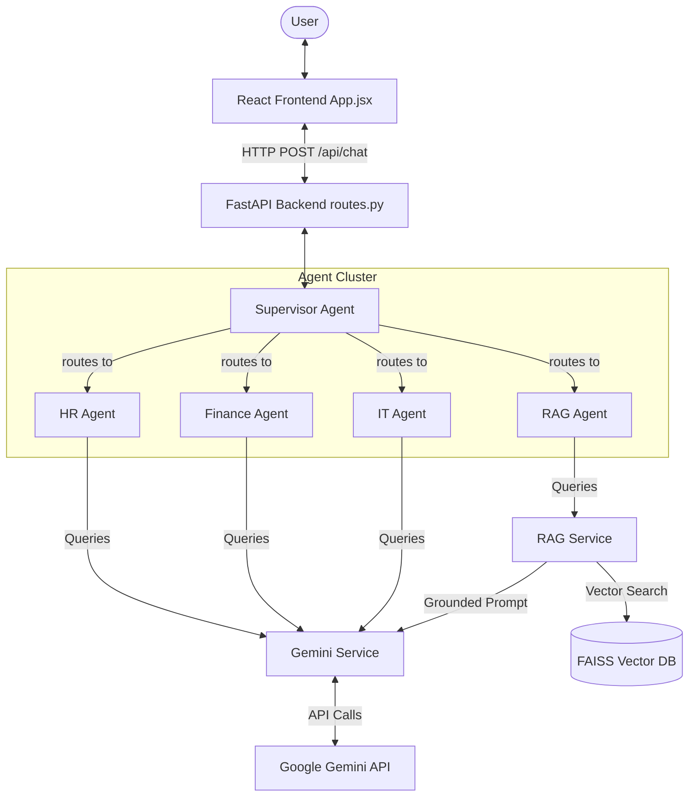
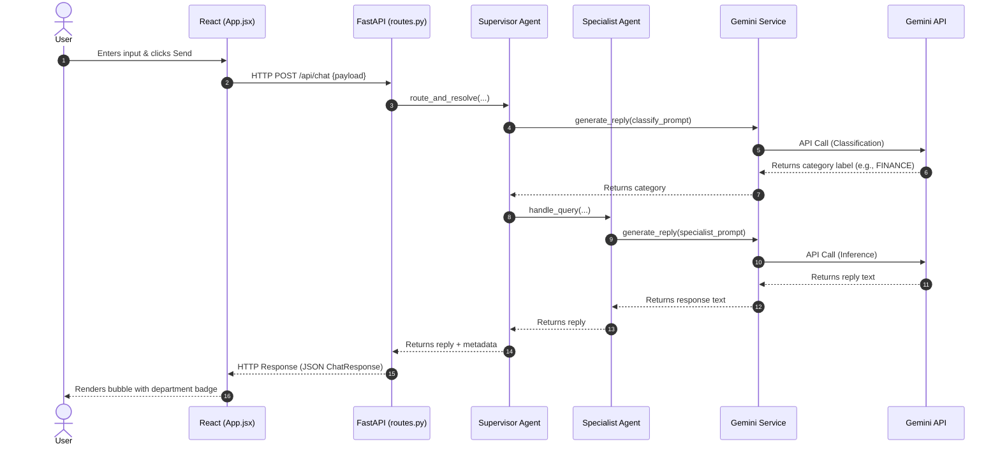

# Phase 4 Architecture — Agent Architecture

This document outlines the architecture, flow diagrams, data paths, and file breakdown for Phase 4 of the Enterprise AI Knowledge Assistant.

---

## 1. Overall Architecture

Phase 4 introduces a multi-agent system where a central Supervisor Agent classifies and routes queries to specialized domain expert agents (HR, Finance, IT, and RAG).

---

## 2. In-Depth Execution Flow

### A. Frontend Data Flow
1. **User Action:** The user types a query (e.g. *"What is the leave policy?"*) and hits Send.
2. **State Updates:** React saves the query to the message state and marks the loading state.
3. **API Dispatch:** `api.js` fires a POST request to `/api/chat` with the query.
4. **Badge Selection:** The response returns a JSON payload containing an `agent_name` and `agent_type`. React matches this metadata to specific classes in `ChatMessage.jsx` to render a colored bubble and emoji badge (e.g., 👔 Handled by: HR Agent).

### B. Backend Data Flow & Routing
1. **Endpoint Access:** FastAPI intercepts the request inside `/api/chat` and forwards it to `supervisor_agent.route_and_resolve(...)`.
2. **Supervisor Classification:** The Supervisor formats a zero-shot prompt outlining agent guidelines and requests classification from Gemini.
3. **Department Allocation:** Gemini outputs a category token (e.g. `HR`).
4. **Specialist Processing:** The Supervisor imports and routes the query to `hr_agent.handle_query(...)`.
5. **Prompt Augmentation:** The specialist agent injects domain rules into the prompt template and queries the Gemini SDK wrapper (`gemini_service`).
6. **Gemini Failover Execution:** If a rate-limit exception (HTTP 429) occurs, `gemini_service` catches the error, sleeps briefly, and rotates the active model through fallbacks.
7. **HTTP Serialization:** The final response text, alongside execution details, is serialized to the client.

### C. Chat Request Sequence Diagram

---

## 3. Important Files & What They Do

### A. Agent Cluster (`backend/app/agents/`)
* **[supervisor_agent.py](file:///c:/Users/rukka/OneDrive/Desktop/AI%20Tools/enterprise-ai-assistant/enterprise-ai-assistant/backend/app/agents/supervisor_agent.py):** Main coordination hub. Uses LLM classification to dispatch queries to specialists.
* **[hr_agent.py](file:///c:/Users/rukka/OneDrive/Desktop/AI%20Tools/enterprise-ai-assistant/enterprise-ai-assistant/backend/app/agents/hr_agent.py):** Specialist agent loaded with instructions for company handbooks and benefits.
* **[finance_agent.py](file:///c:/Users/rukka/OneDrive/Desktop/AI%20Tools/enterprise-ai-assistant/enterprise-ai-assistant/backend/app/agents/finance_agent.py):** Specialist agent loaded with rules for expenses, budgets, and invoicing.
* **[it_agent.py](file:///c:/Users/rukka/OneDrive/Desktop/AI%20Tools/enterprise-ai-assistant/enterprise-ai-assistant/backend/app/agents/it_agent.py):** Specialist agent loaded with instructions for network support, access rights, and setups.
* **[rag_agent.py](file:///c:/Users/rukka/OneDrive/Desktop/AI%20Tools/enterprise-ai-assistant/enterprise-ai-assistant/backend/app/agents/rag_agent.py):** Specialist agent bridging the agents layer with the page-aware document search pipeline (`rag_service.py`).

### B. Core Services (`backend/app/services/`)
* **[gemini_service.py](file:///c:/Users/rukka/OneDrive/Desktop/AI%20Tools/enterprise-ai-assistant/enterprise-ai-assistant/backend/app/services/gemini_service.py):** Manages connection to Gemini models, handling model rotations on rate limit exhaustion.
* **[rag_service.py](file:///c:/Users/rukka/OneDrive/Desktop/AI%20Tools/enterprise-ai-assistant/enterprise-ai-assistant/backend/app/services/rag_service.py):** Provides context document embedding, vector searching, and confidence scoring.
* **[vector_store.py](file:///c:/Users/rukka/OneDrive/Desktop/AI%20Tools/enterprise-ai-assistant/enterprise-ai-assistant/backend/app/services/vector_store.py):** Manages the local FAISS in-memory index and metadata persistence.
