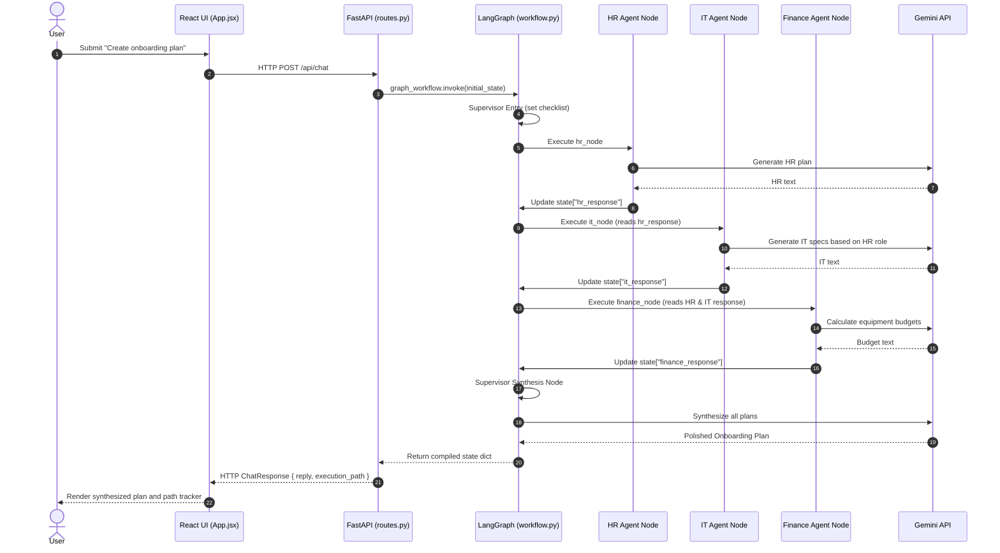

# Phase 5 Architecture — LangGraph + A2A Communication

This document outlines the architecture, flow diagrams, data paths, and file breakdown for Phase 5 of the Enterprise AI Knowledge Assistant.

---

## 1. Overall Architecture

Phase 5 replaces the static routing of Phase 4 with a stateful, cyclic orchestration graph compiled via **LangGraph**. The system maintains a shared state dictionary throughout the lifecycle of a complex workflow:

```mermaid
graph TD
    User([User]) <--> React[React Frontend App.jsx]
    React <-->|HTTP POST /api/chat| FastAPI[FastAPI Backend routes.py]
    
    subgraph FastAPI Backend App
        routes[routes.py Router] -->|Classifies query| Type{Plan Type?}
        Type -->|Simple Query| Direct[Direct Agent Fallback]
        Type -->|Multi-Agent Plan| LangGraph[Compiled StateGraph Workflow]
        
        subgraph LangGraph Flow (AgentState)
            StateDB[(Shared AgentState Memory)] <--> Supervisor[Supervisor Node]
            Supervisor -->|route_next| Cond{Edge Decision}
            Cond -->|HR Node| HR[HR Agent Node]
            Cond -->|IT Node| IT[IT Agent Node]
            Cond -->|Finance Node| Fin[Finance Agent Node]
            Cond -->|End Node| Synthesis[Supervisor Synthesis Node]
            
            HR <--> StateDB
            IT <--> StateDB
            Fin <--> StateDB
            Synthesis <--> StateDB
        end
    end
    
    HR --> Gemini[Gemini Service]
    IT --> Gemini
    Fin --> Gemini
    Synthesis --> Gemini
    
    Gemini <--> Google[Google Gemini API]
```

---

## 2. In-Depth Execution Flow

### A. Graph Execution Cycle
1. **Entry Node (Supervisor):** Determines the list of required specialist agents based on the query classification (e.g. `remaining_steps = ["HR", "IT", "FINANCE"]`). Pops the head node (`"HR"`), writes `next_agent = "HR"` and `workflow_type = "onboarding"`.
2. **Dynamic Conditional Routing:** The conditional edge evaluator reads `state["next_agent"]` and routes execution to the `hr` node.
3. **Agent-to-Agent Shared State:**
   - The **HR Agent Node** executes, writes `hr_response` into the state, and points back to the Supervisor.
   - The **IT Agent Node** reads `state["hr_response"]` (extracting the hire profile or role), customizes its recommendations, writes `it_response` to the state, and returns to the Supervisor.
   - The **Finance Agent Node** reads both `state["hr_response"]` and `state["it_response"]` to calculate the setup equipment budget, writes `finance_response`, and returns to the Supervisor.
4. **Synthesis Node:** The Supervisor notices `remaining_steps` is empty, pulls all collected department responses, queries Gemini to synthesize a polished consolidated markdown plan, updates `final_reply`, and sets `next_agent = "END"`.

### B. Chat Request Sequence Diagram


---

## 3. Important Files & What They Do

### A. LangGraph Core (`backend/app/graph/`)
* **[state.py](file:///c:/Users/rukka/OneDrive/Desktop/AI%20Tools/enterprise-ai-assistant/enterprise-ai-assistant/backend/app/graph/state.py):** Declares the shared `AgentState` TypedDict schema containing query parameters, node checklist tracks, execution logs, and sub-agent response caches.
* **[workflow.py](file:///c:/Users/rukka/OneDrive/Desktop/AI%20Tools/enterprise-ai-assistant/enterprise-ai-assistant/backend/app/graph/workflow.py):** Compiles the `StateGraph`. Defines the nodes (functions mapping to agent executions), edges (connections), and conditional routes (`route_next`).

### B. Specialized Agents (`backend/app/agents/`)
* **[supervisor_agent.py](file:///c:/Users/rukka/OneDrive/Desktop/AI%20Tools/enterprise-ai-assistant/enterprise-ai-assistant/backend/app/agents/supervisor_agent.py):** Handles classification logic (`classify`) and final plan synthesis.
* **[hr_agent.py](file:///c:/Users/rukka/OneDrive/Desktop/AI%20Tools/enterprise-ai-assistant/enterprise-ai-assistant/backend/app/agents/hr_agent.py), [it_agent.py](file:///c:/Users/rukka/OneDrive/Desktop/AI%20Tools/enterprise-ai-assistant/enterprise-ai-assistant/backend/app/agents/it_agent.py), [finance_agent.py](file:///c:/Users/rukka/OneDrive/Desktop/AI%20Tools/enterprise-ai-assistant/enterprise-ai-assistant/backend/app/agents/finance_agent.py):** Updated to accept `state` context, enabling Agent-to-Agent (A2A) data reading.
* **[rag_agent.py](file:///c:/Users/rukka/OneDrive/Desktop/AI%20Tools/enterprise-ai-assistant/enterprise-ai-assistant/backend/app/agents/rag_agent.py):** Specialist agent performing document citation retrieval.

### C. Frontend Interface (`frontend/src/`)
* **[App.jsx](file:///c:/Users/rukka/OneDrive/Desktop/AI%20Tools/enterprise-ai-assistant/enterprise-ai-assistant/frontend/src/App.jsx):** Standard dashboard containing sidebar sliders, document lists, and chat streams.
* **[components/ChatMessage.jsx](file:///c:/Users/rukka/OneDrive/Desktop/AI%20Tools/enterprise-ai-assistant/enterprise-ai-assistant/frontend/src/components/ChatMessage.jsx):** Parses the return `execution_path` list to render a styled path diagram tracker (e.g. `Supervisor Agent ➔ HR Agent ➔ IT Agent ➔ Finance Agent ➔ Supervisor Agent`) for multi-agent workflows.
