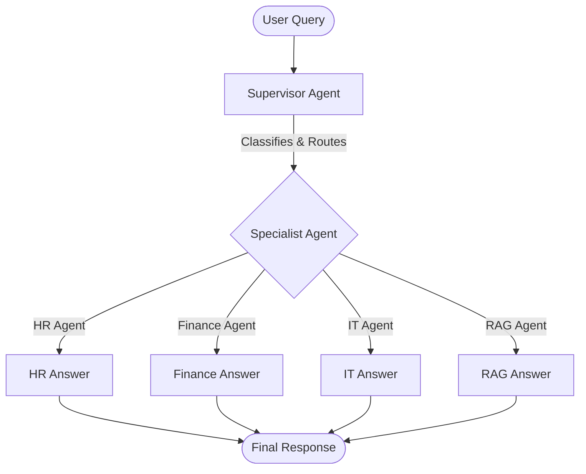

# Phase 5 - LangGraph + Agent-to-Agent Communication

Welcome to the **Phase 5 Learning Guide**. This document is designed to walk a beginner through the stateful multi-agent system introduced in Phase 5 of the **Enterprise AI Knowledge Assistant** project. It details why this phase was needed, how it works, what skills were gained, and how it lays the foundation for future capabilities.

---

## 1. Introduction

### What is Phase 5?
Phase 5 introduces **Stateful Multi-Agent Orchestration** using **LangGraph**. In previous phases, our assistant could only answer questions by routing them to a single specialist agent. In Phase 5, the assistant can execute **complex, multi-step workflows** where multiple specialist agents (HR, IT, Finance) collaborate to produce a unified, comprehensive plan.

### Why We Implemented It
In a real enterprise environment, business processes are rarely resolved by a single person or department. Tasks are cross-functional. For example, onboarding an employee requires HR (for benefits and contracts), IT (for laptops and accounts), and Finance (for payroll and equipment budgets). 

Prior to Phase 5, if you asked the system to *"Create onboarding plan for a new employee"*, it would only route to one department (likely HR), ignoring the critical contributions required from IT and Finance. Phase 5 solves this by introducing a coordinator—the **Supervisor Agent**—which orchestrates a sequential, cyclic plan across multiple agents.

### The Problem It Solves
- **Information Silos:** Allows specialist agents to share context (e.g., the IT Agent knows what job role the HR Agent selected).
- **Execution Orchestration:** Automates the order of department involvement.
- **State Preservation:** Keeps track of the progress of a multi-step workflow.
- **Synthesis:** Combines multiple department outputs into a single, cohesive, client-ready response.

---

## 2. What Was Available Before Phase 5?

### Phase 4 Architecture
Phase 4 utilized a **Single-Agent Routing** architecture. The flow was strictly linear:



### Specialist Agents in Phase 4
1. **HR Agent:** Answers queries about company policies, leave days, benefits, and handbooks.
2. **Finance Agent:** Answers queries about invoicing, submitting expense reports, and simple budget reports.
3. **IT Agent:** Resolves tech support queries, VPN setups, email/account issues, and hardware specs.
4. **RAG Agent:** Retrieves information from uploaded PDF, TXT, and Markdown files to answer questions ground in custom files.

### Limitations of Phase 4
- **No Agent Collaboration:** Agents lived in isolated silos. The HR Agent did not know what the IT Agent was doing.
- **One-Agent-Per-Query Limit:** The Supervisor could only route a query to **one** agent.
- **Struggle with Complex Queries:**
  - *Simple Question:* *"What is the leave policy?"* → Classified as **HR**, routed to HR Agent, resolved successfully.
  - *Complex Workflow Query:* *"Create onboarding plan for a new employee."*
    - **In Phase 4:** The Supervisor Agent classified this as "HR" and routed it exclusively to the HR Agent.
    - **Result:** The user received HR information (orientation, handbook links) but got absolutely no details on laptop configuration (IT) or payroll setup and equipment costs (Finance).

---

## 3. Problems Solved By Phase 5

Phase 5 addresses five critical limitations of single-agent routing:

### Problem 1: Single-Agent Limitation
* **The Issue:** Complex tasks require diverse skills. A single LLM prompt cannot realistically contain the expert instructions for IT, HR, and Finance without suffering from context distraction or hitting token limit caps.
* **The Phase 5 Solution:** Specialization. Each agent remains an expert in its own domain. LangGraph routes the user's request to each expert agent sequentially.

### Problem 2: No Collaboration Between Agents (Information Silos)
* **The Issue:** The IT department needs to know the hire's department to issue the right equipment. If the HR agent defines a "Software Engineer" role, the IT agent must read that choice to allocate a high-spec MacBook Pro rather than a standard office laptop.
* **The Phase 5 Solution:** **Agent-to-Agent (A2A) Communication**. Agents write their decisions to a shared memory block, and downstream agents read those decisions to make informed choices.

### Problem 3: No Workflow Orchestration
* **The Issue:** Tasks must happen in a specific order. You cannot compute an equipment budget (Finance) until you know what laptop has been allocated (IT).
* **The Phase 5 Solution:** **StateGraph Orchestration**. The system coordinates the path of execution: `Supervisor ➜ HR ➜ IT ➜ Finance ➜ Supervisor`.

### Problem 4: No Shared State
* **The Issue:** Without persistent memory across the workflow, the system would forget the original user request or previous decisions mid-execution.
* **The Phase 5 Solution:** The **AgentState** object. It persists the user's message, execution paths, department responses, and metadata throughout the entire cycle.

### Problem 5: Hard to Build Business Processes
* **The Issue:** Real business workflows have loops, conditionals, and validation steps.
* **The Phase 5 Solution:** LangGraph compiles a state machine with nodes and edges that easily maps to flowchart-style enterprise workflows.

---

## 4. New Skills Learned In Phase 5

Phase 5 introduces core concepts of stateful agent graphs:

```text
┌────────────────────────────────────────────────────────┐
│                      LANGGRAPH                         │
│                                                        │
│  ┌───────────────┐  State Update  ┌─────────────────┐  │
│  │     Node      │───────────────>│   Shared State  │  │
│  │  (HR Agent)   │<───────────────│  (AgentState)   │  │
│  └───────────────┘  State Read    └─────────────────┘  │
│          │                                 ▲           │
│    Edge  │ (Route Next)                    │           │
│          ▼                                 │           │
│  ┌───────────────┐                         │           │
│  │     Node      │─────────────────────────┘           │
│  │  (IT Agent)   │  State Update                       │
│  └───────────────┘                                     │
└────────────────────────────────────────────────────────┘
```

### LangGraph
* **What it is:** A library developed by LangChain designed for building stateful, multi-agent applications using graphs.
* **Why it is used:** Unlike standard LLM chains which are strictly linear, LangGraph allows for **cyclic routing** (loops), enabling an agent to consult another agent, loop back to a supervisor, or re-run a step if validation fails.
* **Enterprise Use Cases:** Customer refund systems (validate purchase ➜ inspect reason ➜ approve/deny ➜ issue refund ➜ log transaction).

### StateGraph
* **What it is:** The data structure that defines the graph. It contains nodes (tasks) and edges (the paths connecting tasks) and revolves around a centralized **State**.
* **Why State is important:** State is the single source of truth. It prevents data loss between steps.

### Nodes
* **What they are:** Python functions or runnable classes that perform work. A node takes the current **State** as an input, performs actions (like calling an LLM), and returns a dictionary of updates to write back to the State.
* **Example:** The `hr_node` calls the `hr_agent` to handle the query and returns the `hr_response`.
```python
def hr_node(state: AgentState) -> Dict[str, Any]:
    reply = hr_agent.handle_query(state["message"], state)
    return {"hr_response": reply}
```

### Edges
* **What they are:** The connections between nodes that define routing.
  - **Normal Edges:** Always transition from Node A to Node B (e.g., `workflow.add_edge("hr", "supervisor")`).
  - **Conditional Edges:** Call a routing function to decide the next node dynamically based on the state.
* **Example:** The supervisor routes to different nodes based on the next agent in queue:
```python
def route_next(state: AgentState) -> str:
    next_a = state.get("next_agent")
    if next_a == "HR": return "hr"
    elif next_a == "FINANCE": return "finance"
    elif next_a == "IT": return "it"
    else: return "end"
```

### Shared State
* **What it is:** A TypedDict containing the fields that define our workflow memory.
* **Data Stored:**
  - `message`: Original query (str).
  - `execution_path`: Sequence of nodes executed (List[str]).
  - `remaining_steps`: Unfinished department checklist (List[str]).
  - `hr_response`, `it_response`, `finance_response`: Department answers (str).
  - `final_reply`: The synthesized response (str).

### Agent-to-Agent (A2A) Communication
* **How it works:** Nodes read prior node outputs from the shared state.
* **Code Example:** The `IT Agent` adjusts its instructions based on what the `HR Agent` did:
```python
# Inside it_agent.py
def handle_query(self, query: str, state: dict = None) -> str:
    hr_context = ""
    if state and state.get("hr_response"):
        hr_context = f"\n\nPrior HR Decision: {state['hr_response']}"
    # The IT Agent prompt is now customized using HR's context!
```

### Workflow Orchestration
* **What it is:** The system-guided navigation of a multi-step business process.
* **Why it's needed:** Ensures departments do not run out of order. For example, Finance cannot evaluate equipment budgets until IT has allocated specific devices.

### Multi-Step Reasoning
* **What it is:** The capacity of an AI assistant to break a large query into sub-problems, solve each sub-problem using specialized experts, and then synthesize the final answer.
* **Why one LLM call is not enough:** An LLM trying to do HR, IT, and Finance tasks in a single prompt will often halluncinate details, miss department-specific guidelines, or run out of generation tokens.

---

## 5. How My Project Works In Phase 5

The application uses a FastAPI backend linked to a React frontend. The backend hosts a **LangGraph StateGraph** that manages the multi-agent execution flow.

### Architecture Diagram

```text
       ┌───────────────┐
       │   Frontend    │
       │ (Vite + React)│
       └───────────────┘
               │
      POST     │ Chat Payload
      /api/chat│
               ▼
       ┌───────────────┐
       │ FastAPI Router│
       │  (routes.py)  │
       └───────────────┘
               │
               │ supervisor_agent.classify()
               ▼
      Is it a multi-department plan?
         ├── YES ──> [ Invoke Compiled LangGraph StateGraph ]
         │               │
         │               ▼
         │             ┌─────────────────────────┐
         │             │  Supervisor (Entry)     │ <───┐
         │             └─────────────────────────┘     │
         │                  │                          │
         │                  ▼ (Next Agent in Queue?)   │ (Loop Back)
         │             ┌─────────┼─────────┬─────────┐ │
         │             │         │         │         │ │
         │             ▼         ▼         ▼         │ │
         │          [ HR ]    [ IT ]   [ Finance ]   │ │
         │             │         │         │         │ │
         │             └─────────┴─────────┴─────────┘ │
         │                           │                 │
         │                           ▼                 │
         │                      Update State ──────────┘
         │                           │
         │                           ▼ (No steps left)
         │             ┌─────────────────────────┐
         │             │  Supervisor (Synthesis) │
         │             └─────────────────────────┘
         │                           │
         │                           ▼
         └─── NO  ──> [ Direct Specialist Agent (Phase 4 Fallback) ]
                             │
                             ▼
                    ┌─────────────────┐
                    │ Return Response │
                    └─────────────────┘
```

### Execution Steps
1. **Frontend Input:** The user submits a query (e.g., *"Create onboarding plan for a new employee"*).
2. **Intent Classification:** FastAPI receives the request and calls `supervisor_agent.classify()`.
3. **Branching Decision:**
   - **Simple Intent (e.g., HR Leave policy):** Routes to the direct Phase 4 single-agent fallback (`supervisor_agent.route_and_resolve`).
   - **Complex Plan Intent (e.g., Onboarding plan):** Bypasses fallback and invokes the compiled LangGraph workflow.
4. **LangGraph Pipeline:**
   - **Supervisor Entry Node:** Configures the workflow type and queue (e.g., `remaining_steps = ["HR", "IT", "FINANCE"]`). Sets `next_agent = "HR"`.
   - **HR Node:** Runs the HR Specialist Agent, updates the state with `hr_response`, and routes back to the Supervisor.
   - **Supervisor Intermediate Node:** Reads remaining steps, sets `next_agent = "IT"`.
   - **IT Node:** Reads `hr_response` from state, runs IT Specialist Agent, writes `it_response`, routes back to the Supervisor.
   - **Supervisor Intermediate Node:** Reads remaining steps, sets `next_agent = "FINANCE"`.
   - **Finance Node:** Reads `hr_response` and `it_response`, runs Finance Specialist Agent, writes `finance_response`, routes back to the Supervisor.
   - **Supervisor Synthesis Node:** Detects `remaining_steps` is empty, calls Gemini to synthesize a consolidated final onboarding guide, sets `next_agent = "END"`.
5. **JSON Return:** FastAPI returns the final synthesized reply, along with the `execution_path` list and `workflow_type` string, back to the frontend.
6. **Frontend Render:** The React application displays the final response, along with the active specialist badges and a visual node path tracker (e.g., `Supervisor Agent ➜ HR Agent ➜ IT Agent ➜ Finance Agent ➜ Supervisor Agent`).

---

## 6. Example Workflow

Let's dissect exactly what happens when the query *"Create onboarding plan for a new employee"* is executed:

### Step 1: Supervisor Agent (Entry)
- **What it does:** Classifies the query as `ONBOARDING`. Initializes the State.
- **State Changes:**
  - `workflow_type` ➜ `"onboarding"`
  - `remaining_steps` ➜ `["IT", "FINANCE"]` (the head "HR" is popped for immediate execution)
  - `next_agent` ➜ `"HR"`
  - `execution_path` ➜ `["Supervisor Agent"]`

### Step 2: HR Agent
- **What it does:** Generates a structured employee profile (e.g., Mock Software Engineer, department, start date, HR tasks, and orientation schedules).
- **State Changes:**
  - `hr_response` ➜ `"Role: Senior Software Engineer. Department: Engineering. Start Date: June 20, 2026. Tasks: Document signing, benefits onboarding..."`
  - `execution_path` ➜ `["Supervisor Agent", "HR Agent"]`

### Step 3: IT Agent
- **What it does:** Reads `state["hr_response"]`. Sees that the role is *Senior Software Engineer in the Engineering department*. Allocates developer-grade hardware (e.g., MacBook Pro 16", 32GB RAM) and developer software licenses (Slack, GitHub Enterprise, AWS console).
- **State Changes:**
  - `it_response` ➜ `"Hardware: MacBook Pro 16 inch. Accounts: Active Directory, GitHub Enterprise, AWS Sandbox environment..."`
  - `execution_path` ➜ `["Supervisor Agent", "HR Agent", "IT Agent"]`

### Step 4: Finance Agent
- **What it does:** Reads both `state["hr_response"]` (role/department) and `state["it_response"]` (allocated hardware). Calculates the financial budget, equipment costs, and payroll setup requirements.
- **State Changes:**
  - `finance_response` ➜ `"Equipment Cost: $3,200 (MacBook Pro). Licenses: $150/mo. Payroll setup: W-4 form submitted to ADP..."`
  - `execution_path` ➜ `["Supervisor Agent", "HR Agent", "IT Agent", "Finance Agent"]`

### Step 5: Supervisor Agent (Synthesis)
- **What it does:** Identifies that `remaining_steps` is empty. Collects the replies from HR, IT, and Finance. Feeds them to Gemini to synthesize a polished, unified onboarding document.
- **State Changes:**
  - `final_reply` ➜ *[A clean, unified markdown onboarding plan with HR guidelines, IT setup details, and Finance budgets]*
  - `next_agent` ➜ `"END"`
  - `execution_path` ➜ `["Supervisor Agent", "HR Agent", "IT Agent", "Finance Agent", "Supervisor Agent"]`

---

## 7. Why Phase 5 Is Better Than Phase 4

| Feature | Phase 4 (Single-Agent Routing) | Phase 5 (LangGraph Orchestration) |
| :--- | :--- | :--- |
| **Routing** | Direct. Supervisor routes query to exactly one specialist. | Cyclic. Nodes execute sequentially and route back to the supervisor. |
| **Collaboration** | **None.** Agents are isolated and cannot share data. | **A2A Enabled.** Downstream agents read upstream decisions from State. |
| **State Management** | Stateless. Every API request is evaluated from scratch. | Stateful. State is maintained across all nodes until synthesis. |
| **Workflows** | Limited to single questions (e.g. Leave Policy). | Supports multi-step plans (e.g. Onboarding, Travel plans). |
| **Complexity** | Low. Easy to debug, but limited capabilities. | Medium. Uses graphs, enabling full enterprise business logic. |
| **Real-world Usage** | Q&A Helpdesk. | Full Business Process Automation. |

---

## 8. Real Enterprise Use Cases

Here are five real-world enterprise applications of a Phase 5 multi-agent architecture:

### 1. Employee Onboarding
* **Agents:** HR, IT, Facilities, Finance.
* **Process:** HR creates the employee file ➜ Facilities allocates a desk/workspace ➜ IT provisions accounts and configures hardware ➜ Finance establishes payroll.

### 2. Travel Approval & Reimbursement Workflow
* **Agents:** Travel Agent, Finance, HR.
* **Process:** Travel Agent drafts an itinerary ➜ HR checks if the employee has sufficient leave/travel allowance ➜ Finance validates the travel costs against departmental travel policies and budget.

### 3. Customer Support Escalation
* **Agents:** Triage Agent, Technical Support, Finance (Refunds).
* **Process:** Triage evaluates user complaint severity ➜ Technical Support solves the issue or validates a defect ➜ If unsolvable, Finance Agent initiates refund processing.

### 4. Insurance Claim Processing
* **Agents:** Intake Specialist, Claim Evaluator, Fraud Specialist, Finance.
* **Process:** Intake gathers accident reports ➜ Claim Evaluator determines coverage limits ➜ Fraud Specialist checks for anomalies ➜ Finance issues the check.

### 5. Loan Approval Process
* **Agents:** Document Checker, Credit Evaluator, Underwriter, Compliance.
* **Process:** Document Checker validates ID/w2 ➜ Credit Evaluator checks scores ➜ Underwriter assesses risks ➜ Compliance verifies banking laws ➜ Supervisor prints contract.

---

## 9. How To Verify Phase 5 Is Working

You can verify that the system runs both Phase 4 single-agent fallbacks and Phase 5 workflows by running the test suite in the backend directory.

### Running Backend Tests
From the project root:
```bash
cd backend
..\.venv\Scripts\python test_agents.py
```

### Verification Scenarios

#### Scenario A: Simple Routing Fallback (Phase 4)
* **Test Question:** `"What is our PTO policy?"`
* **Expected Path:** `[]` (bypasses LangGraph state machine to minimize API roundtrip times)
* **Expected Agent:** `"HR Agent"`
* **Expected Output:** Direct answer detailing vacation policies.

#### Scenario B: Onboarding Plan Workflow (Phase 5)
* **Test Question:** `"Create onboarding plan for a new employee"`
* **Expected Path:** `["Supervisor Agent", "HR Agent", "IT Agent", "Finance Agent", "Supervisor Agent"]`
* **Expected Workflow:** `"onboarding"`
* **Expected Output:** A comprehensive, formatted plan detailing HR, IT, and Finance sections.

#### Scenario C: Travel Reimbursement Workflow (Phase 5)
* **Test Question:** `"Prepare travel reimbursement plan"`
* **Expected Path:** `["Supervisor Agent", "Finance Agent", "HR Agent", "Supervisor Agent"]`
* **Expected Workflow:** `"travel"`
* **Expected Output:** A plan outlining travel expense policy guidelines (Finance) and leave/approval logistics (HR).

---

## 10. Questions That Still Remain Unsolved

Although Phase 5 is highly orchestrational, it still suffers from serious limitations:

### What Phase 5 Cannot Do:
- **Cannot Access Real Databases:** The agents cannot query actual MySQL, PostgreSQL, or MongoDB databases to check real payroll records or live inventory.
- **Cannot Write to Jira or Salesforce:** The IT agent cannot create a real ticket for hardware provisioning; it can only write a text recommendation plan.
- **Cannot Read from SharePoint or Google Drive:** Document retrieval is limited to files manually uploaded by the user in the RAG sidebar.
- **Cannot Use Web API Tools:** The travel agent cannot check real flight availability or live hotel pricing.

### Why:
Our agents are **isolated from external systems**. They only have access to their LLM reasoning, their instructions, and whatever text is uploaded. They have **no tools** (external functions) to interact with the outside world.

---

## 11. What We Will Learn in Phase 6

To solve these limitations, **Phase 6** introduces **Model Context Protocol (MCP)** and **Tool Calling**.

```text
┌─────────────────┐           MCP           ┌─────────────────┐
│                 │       Connection        │  External Tool  │
│   Phase 5 LLM   │────────────────────────>│  - Database Qry │
│   (Reasoning)   │<────────────────────────│  - Jira Ticket  │
│                 │        Tool Data        │  - API Calls    │
└─────────────────┘                         └─────────────────┘
```

### Key Concepts for Phase 6:
* **Model Context Protocol (MCP):** An open standard protocol designed to connect AI models with local or remote developer tools, databases, and APIs.
* **Tool Calling:** Enabling models to output JSON requests indicating they want to run a function (e.g. `create_jira_ticket(title="Onboard employee")`) instead of just writing text.
* **External System Integration:** Connecting the assistant directly to live enterprise systems like Jira, ServiceNow, Salesforce, and SharePoint.
* **Database Access:** Allowing the Finance Agent to query live accounting software, and the IT Agent to verify inventory availability directly.
* **Agent ➜ Tool Communication:** Giving agents hands to write, edit, delete, and fetch data, moving them from "planning assistants" to "autonomous executors".

---

## 12. Interview Questions & Answers

### Q1: What is the main difference between a linear LLM chain and a LangGraph workflow?
* **Answer:** A linear chain (like a LangChain sequence) executes steps sequentially in a single direction (Step A ➜ Step B ➜ Step C). LangGraph supports cyclic execution paths, meaning nodes can loop back to previous nodes (e.g., looping back to a supervisor or retrying a step upon validation failure) based on runtime decisions.

### Q2: What is the role of the State in a LangGraph StateGraph?
* **Answer:** The State is the central shared memory database for the graph. Every node receives the current state, performs its work, and returns state updates. The graph handles merging these updates back into the state, ensuring downstream nodes can access decisions made by upstream nodes.

### Q3: Why is a Supervisor Node useful in a multi-agent system?
* **Answer:** A Supervisor Node acts as the central router and orchestrator. It manages the queue of steps (which agents need to run next), handles conditional transitions based on the graph state, and performs final response synthesis to combine multiple outputs into a unified client reply.

### Q4: What are Nodes and Edges in a StateGraph?
* **Answer:** 
  - **Nodes:** Python functions or classes that execute logic (e.g., calling an LLM, querying a database) and update the shared state.
  - **Edges:** Connections that define the transition flow between nodes. They can be normal (always go to a specific node) or conditional (use a routing function to decide the next step dynamically).

### Q5: How do agents communicate with each other in LangGraph (Agent-to-Agent/A2A)?
* **Answer:** They communicate through **State Sharing**. When Agent A finishes, it writes its output to a designated state key (e.g., `hr_response`). When Agent B executes, it reads `state["hr_response"]` and adjusts its prompt context accordingly.

### Q6: Why keep Phase 4 routing as a fallback instead of running everything through LangGraph?
* **Answer:** Running every request through a compiled graph introduces overhead (state serialization, multiple supervisor routing checks). Simple, single-department queries (like a leave policy request) only require one specialist agent, so bypassing LangGraph minimizes roundtrip latencies.

### Q7: What is "Multi-Step Reasoning" and why is it superior to single-prompt execution?
* **Answer:** Multi-step reasoning divides a complex query into sequential tasks solved by domain-specific agents. It is superior because it prevents "prompt bloating," reduces hallucinations, keeps agent instructions focused, and manages token budgets efficiently.

### Q8: What happens when a specialist node returns a dictionary in its output?
* **Answer:** In LangGraph, the dictionary returned by a node is automatically merged into the shared State. For instance, returning `{"it_response": "Laptop configured"}` updates the `it_response` key in the graph's `AgentState` object.

### Q10: How does the Supervisor node know when to stop the workflow?
* **Answer:** It monitors the `remaining_steps` list in the State. When `remaining_steps` is empty, it bypasses specialist routing, calls the synthesis prompt to compile the final report, and routes the transition to the special `END` token.

### Q11: What is a Conditional Edge? Give an example from this project.
* **Answer:** A conditional edge is a routing mechanism that decides the next transition path dynamically by evaluating a function at runtime. In our project, `workflow.add_conditional_edges("supervisor", route_next, ...)` evaluates `route_next(state)` to route the flow to `"hr"`, `"it"`, `"finance"`, or `END`.

### Q12: What type of state schema is used in this project, and how are updates handled?
* **Answer:** We use a Python `TypedDict` schema (`AgentState`). Updates returned by nodes are merged into the state. By default, LangGraph overwrites existing keys with new values unless a reducer function (like `operator.add`) is specified for lists.

### Q13: How can we prevent rate-limiting in a multi-agent system that executes sequential LLM calls?
* **Answer:** We can implement dynamic model rotation and exponential backoff. In our project, `GeminiService` intercepts `ResourceExhausted` exceptions, pauses execution, and automatically rotates requests to an alternative model in its list.

### Q14: If a downstream agent needs to check context from an uploaded PDF, how does it do so in Phase 5?
* **Answer:** The request routes through the RAG Agent node. The RAG Agent extracts context from the FAISS vector index based on the user query, writes this grounded text to `state["rag_response"]`, which can then be read by other nodes.

### Q15: What is the primary limitation of Phase 5 when dealing with action-oriented requests like "Book a flight"?
* **Answer:** Phase 5 agents lack external integrations (tools). They can only formulate recommendations and plan descriptions. They cannot execute actions in external systems, database tables, or web APIs.

### Q16: How will Model Context Protocol (MCP) in Phase 6 improve upon Phase 5?
* **Answer:** MCP provides a standardized framework to connect LLMs directly to external data sources, local processes, and APIs. Instead of merely planning, agents will be able to perform action-oriented executions like writing database entries or creating Jira tickets.
