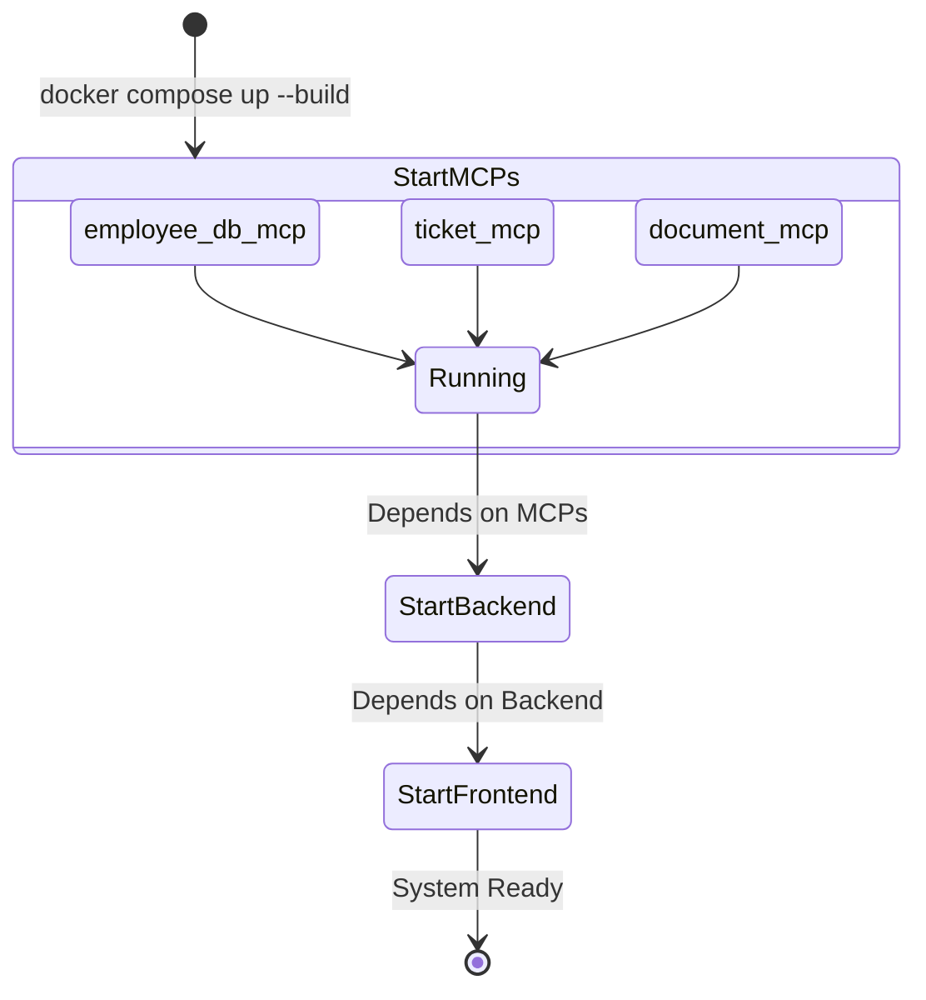

# Phase 7 Technical Architecture Guide: Docker Integration

This document provides a deep dive into the containerization architecture of the **Enterprise AI Knowledge Assistant**. It explains the internal layout, security, storage persistence, and routing pathways of all 5 docker containers.

---

## 1. Global Architecture Diagram

```mermaid
flowchart TD
    subgraph Host OS
        ports_fe["Host Port 5173"]
        ports_be["Host Port 8000"]
        env_sec["GEMINI_API_KEY (Host Environment)"]
    end

    subgraph ai-assistant-network (Bridge)
        frontend["frontend Container\n(Nginx Port 80)"]
        backend["backend Container\n(FastAPI Port 8000)"]
        mcp_emp["employee-db-mcp Container\n(HTTP Port 8001)"]
        mcp_tck["ticket-mcp Container\n(HTTP Port 8002)"]
        mcp_doc["document-mcp Container\n(HTTP Port 8003)"]
    end

    subgraph Persistent Storage Volumes
        vol_emp[(ai-assistant-employee-db)]
        vol_tck[(ai-assistant-ticket-db)]
        vol_faiss[(ai-assistant-faiss-data)]
    end

    %% Routing lines
    ports_fe -->|port map 5173:80| frontend
    ports_be -->|port map 8000:8000| backend

    frontend -->|api calls / proxy| backend
    env_sec -->|injected| backend
    env_sec -->|injected| mcp_doc

    backend -->|JSON-RPC HTTP POST| mcp_emp
    backend -->|JSON-RPC HTTP POST| mcp_tck
    backend -->|JSON-RPC HTTP POST| mcp_doc

    %% Volume links
    mcp_emp ---|mounts /data| vol_emp
    mcp_tck ---|mounts /data| vol_tck
    mcp_doc ---|mounts /app/app/data| vol_faiss
    backend ---|mounts /app/app/data| vol_faiss
```

---

## 2. Service-by-Service Breakdown

### A. Frontend Container (`frontend`)
*   **Base Image:** `node:20-alpine` (Stage 1 Build), `nginx:alpine` (Stage 2 Run).
*   **Port Mapping:** Maps host port `5173` to container port `80`.
*   **Startup Action:** Executes `nginx -g 'daemon off;'`.
*   **Role:** Compiles the React SPA using Vite, copies output assets to `/usr/share/nginx/html`, and serves them. It proxies all `/api` requests to the FastAPI container using a custom Nginx configuration.

### B. Backend Container (`backend`)
*   **Base Image:** `python:3.11-slim`.
*   **Port Mapping:** Maps host port `8000` to container port `8000`.
*   **Startup Action:** Runs `uvicorn app.main:app --host 0.0.0.0 --port 8000`.
*   **Role:** Runs the FastAPI application, coordinates the LangGraph multi-agent system, handles file uploads, writes vectors to the shared volume, and calls the 3 MCP servers.

### C. Employee DB MCP Container (`employee-db-mcp`)
*   **Base Image:** `python:3.11-slim` (using the backend build context).
*   **Container Port:** Listens on port `8001` (internal network only).
*   **Startup Action:** Runs `python app/mcp/employee_db_server.py`.
*   **Role:** Runs `employee_db_server.py` in HTTP mode. Handles SQL queries against the employee SQLite database and returns data.

### D. Ticket MCP Container (`ticket-mcp`)
*   **Base Image:** `python:3.11-slim` (using the backend build context).
*   **Container Port:** Listens on port `8002` (internal network only).
*   **Startup Action:** Runs `python app/mcp/ticket_server.py`.
*   **Role:** Runs `ticket_server.py` in HTTP mode. Handles support ticket creations and status checks.

### E. Document MCP Container (`document-mcp`)
*   **Base Image:** `python:3.11-slim` (using the backend build context).
*   **Container Port:** Listens on port `8003` (internal network only).
*   **Startup Action:** Runs `python app/mcp/document_server.py`.
*   **Role:** Runs `document_server.py` in HTTP mode. Uses `faiss-cpu` to perform cosine similarity searches on files in the shared `faiss_volume` and calls the Gemini embedding API to embed search queries.

---

## 3. Container Communication & Network Architecture

All containers are joined to a custom bridge network named `ai-assistant-network`. 

Docker Compose sets up a built-in DNS service, meaning containers can communicate using their service names as hosts rather than using IP addresses.

*   **FastAPI to Employee MCP:** Sends JSON-RPC POST payloads to `http://employee-db-mcp:8001/`
*   **FastAPI to Ticket MCP:** Sends JSON-RPC POST payloads to `http://ticket-mcp:8002/`
*   **FastAPI to Document MCP:** Sends JSON-RPC POST payloads to `http://document-mcp:8003/`

This decouples Python subprocess handling, avoiding local stdin/stdout piping constraints entirely.

---

## 4. Volume Persistence Scheme

We mount 3 Docker Volumes to preserve local databases and uploaded content:

1.  **`ai-assistant-employee-db`:** Mounted inside the `employee-db-mcp` container at `/data`. Configures SQLite path `SQLITE_DB_PATH=/data/employee.db`.
2.  **`ai-assistant-ticket-db`:** Mounted inside the `ticket-mcp` container at `/data`. Configures SQLite path `SQLITE_DB_PATH=/data/ticket.db`.
3.  **`ai-assistant-faiss-data` (Shared):** Mounted inside the `backend` container and the `document-mcp` container at `/app/app/data`. This allows the backend to write FAISS pickle indices and page texts, and the Document MCP server to immediately read them for semantic search queries.

---

## 5. Startup and Dependency Sequence



1.  **Stage 1:** The 3 MCP servers start up (`employee-db-mcp`, `ticket-mcp`, `document-mcp`). They initialize databases and bind to ports `8001`, `8002`, and `8003`.
2.  **Stage 2:** The `backend` container starts. It waits for the MCP servers to be running, reads `GEMINI_API_KEY` from the environment, and configures endpoints.
3.  **Stage 3:** The `frontend` container starts, compiles the source, starts Nginx on port `80`, and exposes it on host port `5173`.
