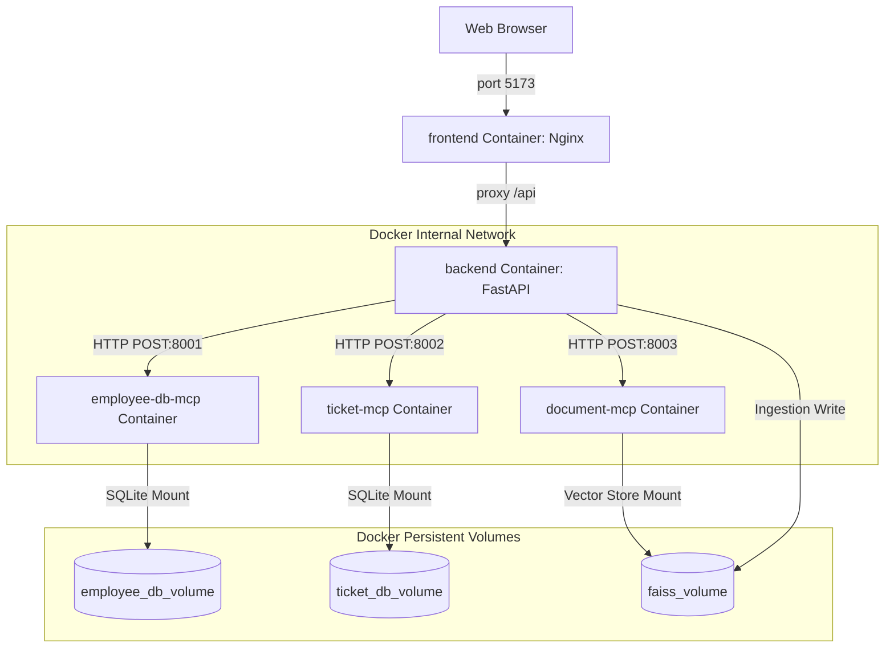

# Phase 7 Docker Learning Guide: Containerization

Welcome to the **Phase 7 Learning Guide**. This document explores the architectural shift from local process execution to isolated, containerized environments. It explains the core concepts of Docker, why we need it, how our project implements it, and prepares you for enterprise engineering discussions.

---

## 1. What is Docker?

**Docker** is an open-source platform that automates the deployment of applications inside lightweight, portable, and self-sufficient software containers. 

Unlike traditional virtualization (which virtualizes hardware to run entire Guest OS stacks), Docker virtualizes the host operating system's kernel, allowing applications to share the host OS resources while remaining isolated in user space.

---

## 2. Why Docker Was Created

Before Docker, developers and system administrators struggled with the **"matrix of hell"**—deploying multiple applications with varying dependencies (databases, languages, libraries) across different physical or virtual servers (local development, test environments, production data centers). 

Docker standardizes how applications are built, packaged, and run, turning code and dependencies into a single, standardized "shipping container" that runs the same way on any machine.

---

## 3. Problems in Phase 6 (Local Run Model)

In Phase 6, all components were run directly on the host computer:

*   **Python Version Mismatches:** If the developer has Python 3.13, a library like `faiss-cpu` might fail to compile or import, whereas it works fine on another machine with Python 3.11.
*   **Missing Dependencies:** Spawning MCP servers via `subprocess` relies on the active virtual environment containing all required packages (such as `google-generativeai`). If a package is missing, the subprocess crashes silently or throws decoding errors.
*   **Different Environments:** Path separators on Windows (`\`) differ from Unix (`/`). Operating system differences cause standard input/output (stdio) pipe locks, leading to intermittent JSON-RPC communication errors.
*   **Setup Complexity:** To start the application, a developer must open multiple shell windows:
    1.  Tab 1: React dev server (`npm run dev`)
    2.  Tab 2: FastAPI dev server (`uvicorn app.main:app`)
    3.  Ensure database files (`employee.db`, `ticket.db`) exist in the exact local folders.

---

## 4. How Docker Solves These Problems

Docker eliminates environment-specific issues:

*   **Immutable Environments:** The environment is defined in the `Dockerfile`. If it compiles once, it will run exactly the same way in production, ensuring **"it works on my machine"** is no longer a problem.
*   **Decoupled Services:** Rather than running MCP servers as sub-processes under FastAPI, Docker runs each MCP server in its own isolated container. Communication occurs over internal Docker virtual networks via standard network protocols (HTTP POST).
*   **Single Command Setup:** Developers only need a single command to download dependencies, build the project, set up environment variables, mount directories, and boot all 5 services:
    ```bash
    docker compose up --build
    ```

---

## 5. Core Docker Concepts

| Concept | Explanation | Project Example |
| :--- | :--- | :--- |
| **Docker Image** | A read-only package containing application code, runtimes, system tools, libraries, and settings. | The compiled `ai-assistant-backend` image containing Python 3.11, FastAPI, and LangGraph. |
| **Docker Container** | A runnable instance of a Docker Image. | The running process `mcp-ticket` which executes `ticket_server.py`. |
| **Dockerfile** | A script containing consecutive instructions to build a Docker Image. | `backend/Dockerfile` which installs packages and starts `uvicorn`. |
| **Docker Volume** | A persistent folder mapped from the host to the container to prevent data loss when containers restart. | `ai-assistant-faiss-data` mounted at `/app/app/data` to persist vector pickles. |
| **Docker Network** | A virtual network linking containers so they can communicate using container names as hosts. | `ai-assistant-network` bridge network which enables the backend to query `http://ticket-mcp:8002`. |
| **Docker Compose** | A tool to define and run multi-container applications using a configuration file (`docker-compose.yml`). | The root `docker-compose.yml` coordinating all 5 containers, network bridges, and volumes. |

---

## 6. How Our Project Uses Docker

Our architecture has evolved from a single-machine subprocess model into a microservice-style container stack:



---

## 7. Real Enterprise Examples

*   **Consistent CI/CD Pipelines:** Jenkins or GitHub Actions build a Docker image of the backend. That exact image is tested, pushed to a registry, and deployed to AWS without modification.
*   **Microservice Isolation:** If `document-mcp` experiences high memory usage due to FAISS matrix multiplications, Docker limits its resources. The backend and ticket servers remain healthy.
*   **Blue-Green Deployments:** Spin up a new set of containers (Version 2) on a different port, run health checks, and route traffic from Version 1 containers to Version 2 without downtime.

---

## 8. How to Verify Docker is Working

1.  **Start the Stack:**
    ```bash
    docker compose up --build
    ```
2.  **Verify Running Containers:**
    ```bash
    docker ps
    ```
    *Should display 5 containers: `ai-assistant-frontend`, `ai-assistant-backend`, `mcp-employee-db`, `mcp-ticket`, and `mcp-document`.*
3.  **Check API Health:** Open `http://localhost:8000/api/health` or `http://localhost:8000/api/documents`.
4.  **Confirm RAG Ingestion:** Upload a PDF through the React UI on `http://localhost:5173`. Check that `knowledge_store.pkl` appears on the host volume storage.

---

## 9. What Docker Still Cannot Solve

While Docker is powerful, it is limited to containerizing a single host machine:

*   **Scaling across Multiple Nodes:** Docker Compose cannot schedule containers across separate cloud servers (e.g. 5 physical machines).
*   **Self-Healing (Auto-Restarts):** It doesn't monitor host health or replace crashed host machines automatically.
*   **Dynamic Load Balancing:** Setting up complex traffic distribution (e.g., routing traffic based on CPU limits) requires manual work.
*   **Declarative Rollouts:** Rolling back a failed deployment automatically requires external orchestration.

---

## 10. Preview: What Will Be Solved in Phase 8 (Kubernetes)

To solve multi-host orchestration, **Phase 8** introduces **Kubernetes (K8s)**:

*   **Pods:** Grouping containers (like FastAPI backend and its helper agent sidecars) in shared namespaces.
*   **Deployments:** Running multiple replicas of the backend for high availability and zero-downtime updates.
*   **Services:** Creating internal and external DNS load balancers to route frontend traffic cleanly.
*   **ConfigMaps & Secrets:** Injecting API keys and model parameters dynamically without rebuilding images.

---

## 11. 20 Docker Interview Questions and Answers

### Q1: What is the difference between virtualization and containerization?
*   **Answer:** Virtualization splits physical hardware using a Hypervisor, running an entire Guest Operating System (including its kernel) in each virtual machine. Containerization runs on top of the host OS kernel directly, isolated via cgroups and namespaces, making containers faster, smaller, and more lightweight.

### Q2: What are namespaces and cgroups in Linux, and how does Docker use them?
*   **Answer:** Namespaces provide process isolation (e.g., PID, network, mount namespaces), ensuring a container only sees its own processes and networks. Cgroups (Control Groups) manage resource limits (CPU, memory, disk I/O), preventing a container from consuming all host system resources.

### Q3: What is the difference between a Docker Image and a Docker Container?
*   **Answer:** A Docker Image is a static, read-only blueprint containing the application code, runtimes, and dependencies. A Docker Container is a live, executable instance of that image, running as an isolated process on the host OS.

### Q4: Why is it bad practice to run containers as `root`? How do you fix it?
*   **Answer:** If a container runs as root and is compromised, an attacker can exploit kernel vulnerabilities to gain root access to the host machine. To fix it, define a non-root user in the Dockerfile using `USER` instructions and grant permissions to application folders only.

### Q5: What is the purpose of `.dockerignore`?
*   **Answer:** It prevents large or sensitive files (like `node_modules`, `.env` files, `.git` history, and local databases) from being copied into the Docker build context. This speeds up build times and keeps image sizes small.

### Q6: Explain what "Layer Caching" is during the Docker build process.
*   **Answer:** Each command in a Dockerfile (e.g., `RUN`, `COPY`) creates a read-only layer. When rebuilding, Docker reuses cached layers if the instruction and copied files haven't changed. To optimize cache reuse, place dependencies installation (`pip install`, `npm install`) *before* copying source code.

### Q7: Why do we use multi-stage builds in Dockerfiles?
*   **Answer:** Multi-stage builds use separate `FROM` statements. This allows you to compile or build your application in a temporary container (Stage 1), and then copy only the compiled binaries/assets to a final, minimal runtime container (Stage 2). This reduces image size drastically by excluding compilers, package managers, and source code.

### Q8: What is a Docker Volume, and when should you use it over Bind Mounts?
*   **Answer:** A volume is managed entirely by Docker and stored in a host directory (`/var/lib/docker/volumes/`). Volumes are preferred for production persistence because they are isolated from host file system modifications, portable, and support volume drivers (e.g., NFS, cloud storage).

### Q9: What happens to data stored in a container if it is stopped and deleted?
*   **Answer:** If no volume is mounted, any data written to the container's writable layer is permanently deleted when the container is removed. Stopped containers keep their data, but removing them destroys it.

### Q10: What is the default Docker network driver? How do containers talk to each other?
*   **Answer:** The default driver is `bridge`. When containers run on the same user-defined bridge network, they can communicate using their container names as hostnames (Docker's built-in DNS handles name resolution).

### Q11: Explain the difference between `EXPOSE` and `ports` in Docker.
*   **Answer:** `EXPOSE` is informational metadata in a Dockerfile stating which port the application listens on inside the container. `ports` in `docker-compose.yml` actually maps a host port to the container port, opening up traffic from outside the host system.

### Q12: How do you pass secrets (like `GEMINI_API_KEY`) to a container securely?
*   **Answer:** Pass them as environment variables injected at runtime, or use Docker Compose's environment interpolation (e.g., `${GEMINI_API_KEY}`) to read them from a local `.env` file that is ignored by git. Never bake secrets directly into Dockerfiles or images.

### Q13: What is the role of `depends_on` in Docker Compose? Does it guarantee a service is ready?
*   **Answer:** `depends_on` defines the startup sequence, ensuring dependent services (e.g. databases/MCPs) start *before* the application. However, it only checks if the container is *running*, not if the application is fully booted and accepting requests. Use health checks (`test:` and `condition: service_healthy`) for strict readiness.

### Q14: How does standard input/output (stdio) based MCP communication change in a Docker network?
*   **Answer:** In local runs, standard stdio connects parent and child processes on the same machine. Inside Docker Compose, containers are isolated and cannot share stdio streams. We wrap the MCP servers in a standard HTTP server, allowing the backend to call tools using HTTP POST JSON-RPC frames over the bridge network.

### Q15: Why did we choose `python:3.11-slim` instead of `alpine` for python services?
*   **Answer:** While Alpine is smaller, it uses `musl libc` instead of `glibc` (which standard Linux distributions use). Many Python C-extensions (like `numpy` and `faiss-cpu`) are precompiled for `glibc`. Running them on Alpine requires compiling them from scratch, which is slow and prone to build failures.

### Q16: How do you inspect logs of a single running container in a compose stack?
*   **Answer:** Use the command:
    ```bash
    docker compose logs -f <service_name>
    ```
    *Example: `docker compose logs -f ticket-mcp`*

### Q17: What is the command to stop and remove all containers, networks, and volumes created by Compose?
*   **Answer:**
    ```bash
    docker compose down -v
    ```
    *The `-v` flag is critical to delete the anonymous and named volumes.*

### Q18: What is Docker cgroups and how does it prevent "noisy neighbor" issues?
*   **Answer:** Control Groups (cgroups) limit the CPU, memory, network, and disk performance a container can consume. By setting boundaries on each service, we prevent a single container from consuming all system resources and crashing the server.

### Q19: What is the purpose of `restart: unless-stopped`?
*   **Answer:** It tells Docker to automatically restart the container if it crashes or if the host machine reboots, unless the container was explicitly stopped by the developer.

### Q20: If multiple containers listen on port 80 inside the bridge network, why is there no port conflict?
*   **Answer:** Each container has its own private IP address and network stack inside the virtual bridge network. Port conflicts only occur if you try to bind multiple containers to the same port on the host machine.
