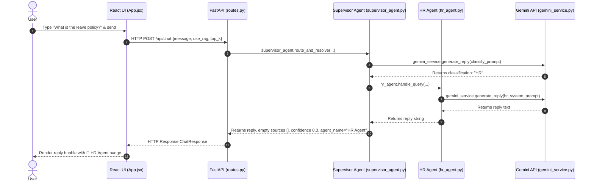
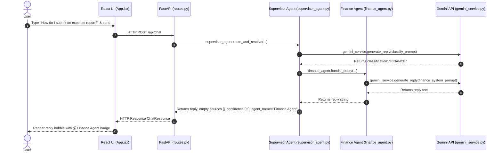
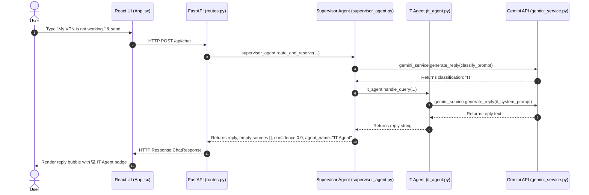
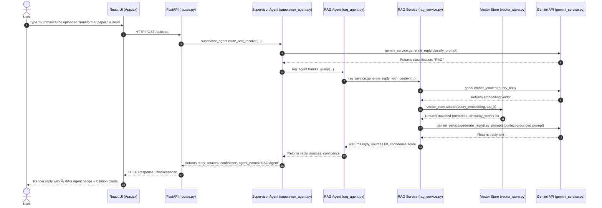

# Senior Developer's Guide: Phase 4 Agent Architecture Deep-Dive

This document provides a comprehensive analysis of the multi-agent architecture implemented in Phase 4 of the Enterprise AI Knowledge Assistant. It outlines the codebase design, traces request flow step-by-step, explains routing logic, includes sequence diagrams, and offers a beginner-friendly breakdown of core concepts.

---

## 1. Request Tracing Flow: "What is the leave policy?"

Here is the exact journey of a user query through the application layer, step by step:

```
[ React UI ] ──(User Interaction)──> [ API Request ] ──(Network)──> [ FastAPI Endpoint ]
                                                                             │
[ Response Rendered ] <──(Render)── [ UI State Update ] <──(Return)── [ Supervisor Agent ]
                                                                             │
                                                                       [ HR Agent ]
                                                                             │
                                                                      [ Gemini API ]
```

### Tracing Details

| Step | Component | File Name | Function Name | Purpose |
| :--- | :--- | :--- | :--- | :--- |
| **1** | **React UI** | [App.jsx](file:///c:/Users/rukka/OneDrive/Desktop/AI%20Tools/enterprise-ai-assistant/enterprise-ai-assistant/frontend/src/App.jsx) | `handleSend` | Captures input, sets UI loading states, appends the user's question to the messages array, and triggers the network call. |
| **2** | **API Client** | [api.js](file:///c:/Users/rukka/OneDrive/Desktop/AI%20Tools/enterprise-ai-assistant/enterprise-ai-assistant/frontend/src/api.js) | `sendChatMessage` | Issues an HTTP `POST` fetch request to `/api/chat` with JSON body payload containing `{ message, use_rag, top_k }`. |
| **3** | **FastAPI Endpoint** | [routes.py](file:///c:/Users/rukka/OneDrive/Desktop/AI%20Tools/enterprise-ai-assistant/enterprise-ai-assistant/backend/app/api/routes.py) | `chat` | Serves as the HTTP entry point. Receives the validated request schema and delegates processing to `supervisor_agent.route_and_resolve`. |
| **4** | **Supervisor Agent** | [supervisor_agent.py](file:///c:/Users/rukka/OneDrive/Desktop/AI%20Tools/enterprise-ai-assistant/enterprise-ai-assistant/backend/app/agents/supervisor_agent.py) | `route_and_resolve` | Formulates the classification prompt, queries Gemini to decide the category (`HR`), and forwards execution to `hr_agent.handle_query`. |
| **5** | **HR Agent** | [hr_agent.py](file:///c:/Users/rukka/OneDrive/Desktop/AI%20Tools/enterprise-ai-assistant/enterprise-ai-assistant/backend/app/agents/hr_agent.py) | `handle_query` | Receives the message, decorates it with HR domain guidelines (handbook, benefits, policies), and asks Gemini for the final answer. |
| **6** | **Gemini Service** | [gemini_service.py](file:///c:/Users/rukka/OneDrive/Desktop/AI%20Tools/enterprise-ai-assistant/enterprise-ai-assistant/backend/app/services/gemini_service.py) | `generate_reply` | Invokes the underlying Google Generative AI SDK, manages model selection/fallback rotation on quota limits, and returns the response string. |
| **7** | **Response Delivery** | [ChatMessage.jsx](file:///c:/Users/rukka/OneDrive/Desktop/AI%20Tools/enterprise-ai-assistant/enterprise-ai-assistant/frontend/src/components/ChatMessage.jsx) | `ChatMessage` | Renders the assistant's reply bubble inside the UI, highlighting the metadata by displaying the `Handled by: HR Agent` badge. |

---

## 2. File-by-File Codebase Deep Dive

The Phase 4 architecture relies on five distinct agents, each with a specialized role:

```text
app/agents/
├── supervisor_agent.py  # Classifier & Router
├── hr_agent.py          # HR Specialist
├── finance_agent.py     # Expense & Invoice Specialist
├── it_agent.py          # Tech Support Specialist
└── rag_agent.py         # Document Retriever Specialist
```

### Agent Architecture Breakdown

### 📂 [supervisor_agent.py](file:///c:/Users/rukka/OneDrive/Desktop/AI%20Tools/enterprise-ai-assistant/enterprise-ai-assistant/backend/app/agents/supervisor_agent.py)
*   **Why it exists:** Coordinates the entire system. Instead of feeding every user message into a single, generic prompt containing all guidelines, the supervisor decides the appropriate subject-matter expert, keeping inference focused and saving token costs.
*   **Class & Structure:** `SupervisorAgent`. Contains `route_and_resolve(...)` which uses a zero-shot classification prompt to categorize incoming queries into `'HR'`, `'FINANCE'`, `'IT'`, or `'RAG'`.
*   **Initialization:** Initialized at the module level:
    ```python
    supervisor_agent = SupervisorAgent()
    ```
*   **Backend Integration:** Directly imported by [routes.py](file:///c:/Users/rukka/OneDrive/Desktop/AI%20Tools/enterprise-ai-assistant/enterprise-ai-assistant/backend/app/api/routes.py) to process all user chats.

### 📂 [hr_agent.py](file:///c:/Users/rukka/OneDrive/Desktop/AI%20Tools/enterprise-ai-assistant/enterprise-ai-assistant/backend/app/agents/hr_agent.py)
*   **Why it exists:** Provides specialized expert assistance regarding employee benefits, holidays, leave policies, and organizational structure guidelines.
*   **Class & Structure:** `HRAgent`. Contains `handle_query(query)`.
*   **Initialization:** Instantiated as `hr_agent = HRAgent()`.
*   **Backend Integration:** Invoked dynamically inside `supervisor_agent.route_and_resolve` if clean classification is `"HR"`.

### 📂 [finance_agent.py](file:///c:/Users/rukka/OneDrive/Desktop/AI%20Tools/enterprise-ai-assistant/enterprise-ai-assistant/backend/app/agents/finance_agent.py)
*   **Why it exists:** Handles fiscal protocols: invoicing, reimbursements, submitting expense sheets, budgets, and hardware purchase procedures.
*   **Class & Structure:** `FinanceAgent`. Contains `handle_query(query)`.
*   **Initialization:** Instantiated as `finance_agent = FinanceAgent()`.
*   **Backend Integration:** Invoked inside `supervisor_agent.route_and_resolve` if clean classification is `"FINANCE"`.

### 📂 [it_agent.py](file:///c:/Users/rukka/OneDrive/Desktop/AI%20Tools/enterprise-ai-assistant/enterprise-ai-assistant/backend/app/agents/it_agent.py)
*   **Why it exists:** Troubleshoots IT requests including VPN problems, software accounts, hardware provisioning requests, and technical systems access.
*   **Class & Structure:** `ITAgent`. Contains `handle_query(query)`.
*   **Initialization:** Instantiated as `it_agent = ITAgent()`.
*   **Backend Integration:** Invoked inside `supervisor_agent.route_and_resolve` if clean classification is `"IT"`.

### 📂 [rag_agent.py](file:///c:/Users/rukka/OneDrive/Desktop/AI%20Tools/enterprise-ai-assistant/enterprise-ai-assistant/backend/app/agents/rag_agent.py)
*   **Why it exists:** Bridges the multi-agent layer with the document ingestion pipelines. When a user asks a question grounded in custom manuals or scientific papers, it delegates processing to the semantic indexing engine.
*   **Class & Structure:** `RagAgent`. Contains `handle_query(query, use_rag, top_k)`.
*   **Initialization:** Instantiated as `rag_agent = RagAgent()`.
*   **Backend Integration:** Executed when the supervisor categorizes a query as `"RAG"` or encounters an unknown classification.

---

## 3. Routing Analysis: "How do I submit an expense report?"

When the user asks: **"How do I submit an expense report?"**, the routing engine undergoes the following evaluation:

1.  **HR Agent is Rejected:** The prompt definitions classify HR as dealing with "leave policies, benefits, holidays, and employee handbook queries." Submitting an expense report is administrative/financial, not a benefit policy or holiday request.
2.  **IT Agent is Rejected:** The IT classification guides handle "laptop requests, VPN issues, access requests, and technical support." An expense submission is a procedural accounting task, not a hardware or network support ticket.
3.  **RAG Agent is Rejected:** RAG is reserved for queries requiring keyword/semantic searching of specific uploaded documents (e.g. "Summarize paper X"). Since this is a standard procedural question, the supervisor leverages the specialized knowledge of the Finance Agent rather than running vector DB queries (unless the user uploaded an expense guidelines PDF and specifically requested a RAG search).
4.  **Finance Agent is Selected:** The supervisor prompt directs the model to assign questions about "expenses, reimbursements, invoices, and budget-related questions" to `FINANCE`. The phrase `"submit an expense report"` aligns with this prompt description, so the query resolves to `"FINANCE"`.

---

## 4. Sequence Diagrams

Here is the runtime message tracing for all four agent classifications:

### A) HR Question


### B) Finance Question


### C) IT Question


### D) RAG Question


---

## 5. Gemini Integration Details

Gemini is called systematically throughout the system:

*   **Where Gemini is called:** 
    *   `SupervisorAgent` calls it to classify queries.
    *   `HRAgent`, `FinanceAgent`, and `ITAgent` call it to generate expert answers.
    *   `RagService` calls it twice: first to embed the query vector using the embedding API, then to generate context-grounded text.
*   **Which file calls Gemini:**
    *   [gemini_service.py](file:///c:/Users/rukka/OneDrive/Desktop/AI%20Tools/enterprise-ai-assistant/enterprise-ai-assistant/backend/app/services/gemini_service.py) handles standard text generation calls (`generate_reply`) using the `google-generativeai` package.
    *   [rag_service.py](file:///c:/Users/rukka/OneDrive/Desktop/AI%20Tools/enterprise-ai-assistant/enterprise-ai-assistant/backend/app/services/rag_service.py) handles embedding vector creation directly using `genai.embed_content`.
*   **What prompt is sent to Gemini:**
    *   *Classification*: A strict zero-shot classification schema instructing the model to output exactly `HR`, `FINANCE`, `IT`, or `RAG` with no explanation.
    *   *Domain Agents*: Roleplay instructions setting the agent persona (e.g. "You are the specialized HR Agent...") followed by the user question.
    *   *RAG Agent*: A directive to answer *only* using details located in the surrounding `--- RETRIEVED CONTEXT ---` blocks, with strict instructions to state if information is missing.
*   **How Gemini response comes back:**
    *   `google.generativeai.GenerativeModel.generate_content` runs blocking request threads.
    *   Response text is accessed using `response.text` and returned to callers. If a `ResourceExhausted` exception is caught, `gemini_service` rotates the active model through an array of fallback models (e.g. `gemini-3.5-flash`, `gemini-2.5-flash`, `gemini-2.0-flash`, etc.).

---

## 6. RAG Mechanism & PDF Search

When a RAG-classified query executes, it interacts with the local vector database:

```
[ Ingest Document ] ──> Page-by-Page Extraction ──> Chunking ──> Embed ──> Save store.pkl
                                                                                 │
                                                                                 ▼
[ Search Query ] ────> Embed Query ──> Cosine Search FAISS Index ──> Return Metadata Map
```

*   **Where RAG is called:** Routed via `rag_agent.py` to `rag_service.generate_reply_with_context()`.
*   **How PDF search works:**
    *   *Ingestion*: When files are uploaded, [document_service.py](file:///c:/Users/rukka/OneDrive/Desktop/AI%20Tools/enterprise-ai-assistant/enterprise-ai-assistant/backend/app/services/document_service.py) parses PDF pages. Text is split into structured page chunks.
    *   *Embedding & Storage*: Each chunk text is embedded using `gemini-embedding-001`. The chunks and vectors are saved to a pickle file [knowledge_store.pkl](file:///c:/Users/rukka/OneDrive/Desktop/AI%20Tools/enterprise-ai-assistant/enterprise-ai-assistant/backend/data/knowledge_base/knowledge_store.pkl).
    *   *FAISS Indexing*: During application boot or when a document is added, [vector_store.py](file:///c:/Users/rukka/OneDrive/Desktop/AI%20Tools/enterprise-ai-assistant/enterprise-ai-assistant/backend/app/services/vector_store.py) initializes an in-memory `faiss.IndexFlatIP` index with a normalized representation of all chunk vectors.
    *   *Inference Query*: When a question is asked, it is vectorized. The query vector is normalized, and `faiss_index.search` is run, retrieving the indices of closest matches.
*   **How citations are returned:**
    *   The retrieval process maps the returned FAISS indices back to metadata dictionaries containing `document_name`, `page_number`, `chunk_id`, and `text`.
    *   These citations are passed in the JSON response payload.
    *   The frontend maps over the citations, rendering them as expandable panels within `ChatMessage.jsx`.

---

## 7. Beginner-Friendly Summary: "What I learned in Phase 4"

*   **Agent:** A self-contained AI module equipped with a tailored system prompt and a specific instruction set, allowing it to behave as a dedicated expert (e.g., an IT Specialist or an HR Coordinator).
*   **Supervisor Agent:** A central router agent. It acts like a company receptionist, evaluating incoming questions and transferring them to the correct department's agent.
*   **Routing:** The process of classifying a user's question and redirecting it to a specific sub-agent instead of sending everything to a single general-purpose chat prompt.
*   **Agent Responsibilities:** Keeping code modular by assigning narrow domains of expertise (e.g., Finance, IT, HR) to different classes, making debugging, updates, and prompt engineering easier.
*   **RAG Agent:** An agent connected to custom documents. It retrieves relevant text pieces from a local semantic database to answer questions about user-uploaded PDFs or TXT files.
*   **Request Flow:** The complete loop of a user query: from entering text in React, sending a POST request to FastAPI, routing via the Supervisor, executing the domain agent's prompt via Gemini, and rendering the final markdown bubble.
