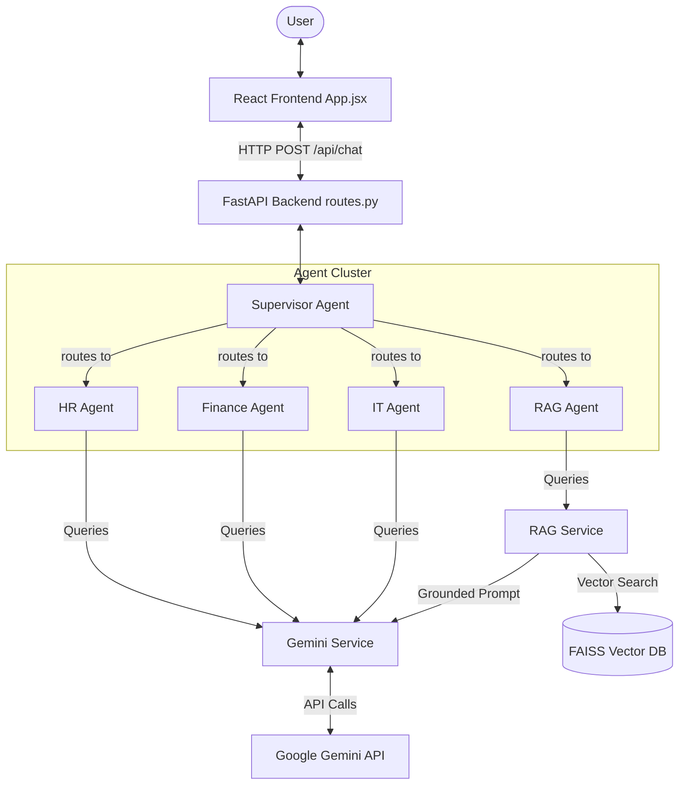
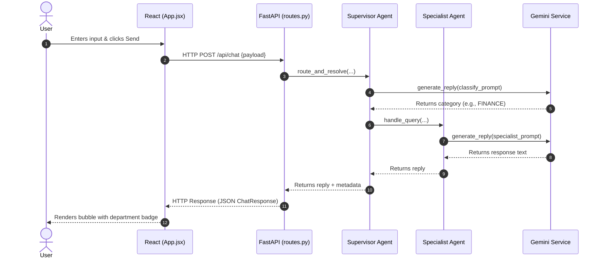
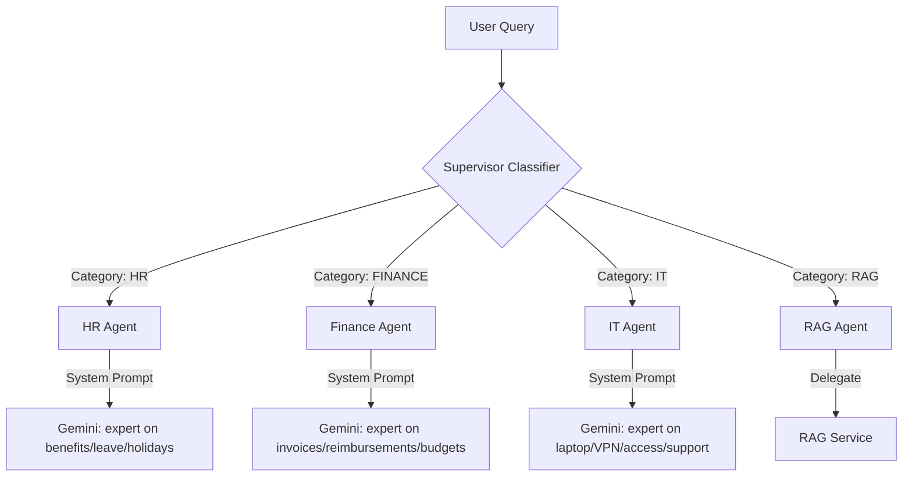
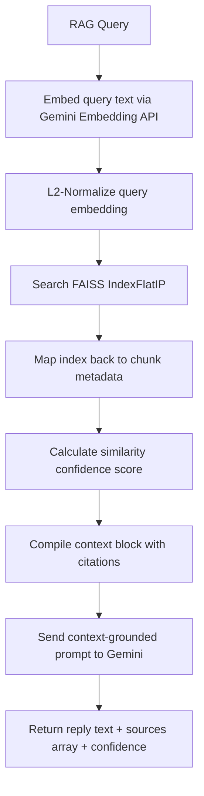

# Senior AI Engineer Mentorship Guide: Phase 4 Agent Architecture

Welcome to the comprehensive walkthrough of your **Enterprise AI Knowledge Assistant (Phase 4)**. This guide provides a detailed look at the structural decisions, query execution traces, agent routing logic, RAG implementations, and visual system diagrams based directly on your codebase.

---

## 1. Project Folder Structure

Your repository follows a modern, decoupled full-stack architecture:

```text
enterprise-ai-assistant/
├── backend/                  # FastAPI Web Layer & Agent/RAG Logic
│   ├── app/
│   │   ├── agents/           # Specialized Agent Modules (Phase 4)
│   │   ├── api/              # API Endpoint Routes
│   │   ├── core/             # Application Settings & Configurations
│   │   ├── schemas/          # Data Validation & Pydantic Contracts
│   │   ├── services/         # Core Operations (Gemini, RAG, Ingestion)
│   │   └── main.py           # Application Entrypoint (Uvicorn Server)
│   ├── requirements.txt      # Python Dependencies
│   └── test_agents.py        # Local testing script
│
└── frontend/                 # React UI Layer (Vite & ES Modules)
    ├── src/
    │   ├── components/       # Presentational & Stateful Components
    │   ├── api.js            # Network Client (Fetch wrapper)
    │   ├── App.jsx           # Root layout & message container
    │   └── styles.css        # Visual styles & badge configurations
    ├── index.html            # Vite template entry point
    └── package.json          # Node dependencies & launch scripts
```

### Why Frontend and Backend are Kept Separate:
1.  **Separation of Concerns:** The React frontend is focused solely on client-side state, responsiveness, rendering markdown messages, and visual animations. The FastAPI backend is focused on compute-heavy operations: FAISS database searches, document parsing/chunking, model selection/rotation, and prompt orchestration.
2.  **Scalability:** You can deploy them independently. For instance, the static frontend files can be served from a high-speed Content Delivery Network (CDN) like Cloudflare, while the Python backend scales dynamically on an containerized cluster to handle heavy embedding calculations.
3.  **Client-Side Security:** API keys, database paths, and model logic are stored securely on the backend server. The client browser only interacts with endpoints and receives sanitized JSON payloads, preventing API key exposure.

---

## 2. Frontend Flow

This is how data moves through your React interface:

*   **Vite Entry Point:** [index.html](file:///c:/Users/rukka/OneDrive/Desktop/AI%20Tools/enterprise-ai-assistant/enterprise-ai-assistant/frontend/index.html) pulls in [main.jsx](file:///c:/Users/rukka/OneDrive/Desktop/AI%20Tools/enterprise-ai-assistant/enterprise-ai-assistant/frontend/src/main.jsx), which renders the root React component: [App.jsx](file:///c:/Users/rukka/OneDrive/Desktop/AI%20Tools/enterprise-ai-assistant/enterprise-ai-assistant/frontend/src/App.jsx).
*   **Root Layout & Inputs:** [App.jsx](file:///c:/Users/rukka/OneDrive/Desktop/AI%20Tools/enterprise-ai-assistant/enterprise-ai-assistant/frontend/src/App.jsx) initializes the state of the conversation using React `useState` hooks for the input text, message arrays, loading circles, and settings variables (`useRag`, `topK`).
*   **Executing the Network Call:** When a user types a query and triggers `handleSend()`, the function appends the user's message to the state list, clears the input box, and invokes `sendChatMessage(...)` defined in [api.js](file:///c:/Users/rukka/OneDrive/Desktop/AI%20Tools/enterprise-ai-assistant/enterprise-ai-assistant/frontend/src/api.js).
*   **Response Display & Badge Rendering:** Once the backend returns a response, `App.jsx` stores it in the messages array. React iterates over the messages and passes each to the [ChatMessage.jsx](file:///c:/Users/rukka/OneDrive/Desktop/AI%20Tools/enterprise-ai-assistant/enterprise-ai-assistant/frontend/src/components/ChatMessage.jsx) component.
*   **Showing the Selected Agent:** Inside `ChatMessage.jsx`, the component checks if `agentName` is present in the assistant message state. It runs a helper function `getAgentClass(name)` to assign CSS styling (like `.hr-agent`, `.finance-agent`, `.it-agent`, or `.rag-agent`) and `getAgentEmoji(name)` to render corresponding icons (👔, 💰, 💻, 🔍).

---

## 3. Backend Flow

Here is the entry process on the server side:

*   **FastAPI Boot:** [main.py](file:///c:/Users/rukka/OneDrive/Desktop/AI%20Tools/enterprise-ai-assistant/enterprise-ai-assistant/backend/app/main.py) configures the application instance (adding CORS permissions so your frontend on port `5173` can communicate with it) and registers the router endpoints.
*   **Endpoint Trigger:** [routes.py](file:///c:/Users/rukka/OneDrive/Desktop/AI%20Tools/enterprise-ai-assistant/enterprise-ai-assistant/backend/app/api/routes.py) intercepts incoming `POST` requests to `/api/chat` using the `chat(payload: ChatRequest)` handler function.
*   **Data Validation (Schemas):** FastAPI uses [chat.py](file:///c:/Users/rukka/OneDrive/Desktop/AI%20Tools/enterprise-ai-assistant/enterprise-ai-assistant/backend/app/schemas/chat.py) to validate inputs:
    *   `ChatRequest`: Validates that `message` is not empty, `use_rag` is boolean, and `top_k` falls between 1 and 10.
    *   `ChatResponse`: Ensures outgoing JSON strictly matches the defined API shape containing `reply`, `sources`, `confidence`, `agent_name`, `selected_agent`, and `agent_type`.
*   **Business Logic Dispatcher:** `routes.py` imports and executes `supervisor_agent.route_and_resolve(...)` to run agent routing and return the final response back to the client.

---

## 4. Phase 4 Request Flow: "How do I submit an expense report?"

Here is the exact step-by-step query propagation path:

```
[ User Types Question ] ────> App.jsx (React UI)
                                 ↓
                              api.js (POST /api/chat)
                                 ↓
                              routes.py (FastAPI Endpoint)
                                 ↓
                              supervisor_agent.py (Supervisor Agent)
                                 ↓
                              finance_agent.py (Finance Agent Specialist)
                                 ↓
                              gemini_service.py (Gemini API Request)
                                 ↓
                              routes.py (JSON Formatter)
                                 ↓
                              ChatMessage.jsx (UI Badge & Bubble Render)
```

1.  **React UI:** The user enters the text *"How do I submit an expense report?"* in the input element of [App.jsx](file:///c:/Users/rukka/OneDrive/Desktop/AI%20Tools/enterprise-ai-assistant/enterprise-ai-assistant/frontend/src/App.jsx) and presses Enter.
2.  **API Call:** `api.js` builds the POST request and pushes it to `http://localhost:8000/api/chat`.
3.  **FastAPI Route:** `routes.py` receives the JSON payload, validates it via `ChatRequest` schema, and passes the input text to the Supervisor.
4.  **Supervisor Agent:** `supervisor_agent.py` queries Gemini using a classification prompt. Gemini returns the label `"FINANCE"`. The supervisor then imports and executes `finance_agent.handle_query(...)`.
5.  **Finance Agent:** `finance_agent.py` wraps the question in a Finance specialist prompt ("You are an expert on company finance procedures, expenses, invoicing...") and asks Gemini.
6.  **Gemini Call:** `gemini_service.py` executes a blocking request to the active model.
7.  **Response Propagation:** The generated text reply is returned back through the call stack:
    *   `gemini_service.py` → `finance_agent.py`
    *   `finance_agent.py` → `supervisor_agent.py`
    *   `supervisor_agent.py` → `routes.py`
8.  **JSON Response:** `routes.py` maps the returned values to `ChatResponse` model, setting `selected_agent="Finance Agent"` and `agent_type="finance"`, returning it with an HTTP 200 code to the client.
9.  **React Render:** `App.jsx` catches the response and updates the UI state. `ChatMessage.jsx` detects `selected_agent="Finance Agent"` and renders a green-bordered badge displaying `"💰 Handled by: Finance Agent"`.

---

## 5. Agent Files Explanation

### 📂 [supervisor_agent.py](file:///c:/Users/rukka/OneDrive/Desktop/AI%20Tools/enterprise-ai-assistant/enterprise-ai-assistant/backend/app/agents/supervisor_agent.py)
*   **Why it exists:** Acts as the traffic controller. It determines which agent is best suited to handle the incoming request.
*   **Core Class:** `SupervisorAgent`.
*   **How it is Initialized:** Instantiated at module import time as a shared singleton: `supervisor_agent = SupervisorAgent()`.
*   **How it Communicates:** Called by the `/chat` route. It maps the query's classification label to the appropriate specialist instance (`hr_agent`, `finance_agent`, `it_agent`, or `rag_agent`).

### 📂 [hr_agent.py](file:///c:/Users/rukka/OneDrive/Desktop/AI%20Tools/enterprise-ai-assistant/enterprise-ai-assistant/backend/app/agents/hr_agent.py)
*   **Why it exists:** Provides specialized expert assistance regarding employee benefits, holidays, leave policies, and organizational structure guidelines.
*   **Core Class:** `HRAgent`.
*   **How it is Initialized:** Instantiated as `hr_agent = HRAgent()`.
*   **How it Communicates:** Executed by `supervisor_agent.route_and_resolve()` if classification resolves to `HR`.

### 📂 [finance_agent.py](file:///c:/Users/rukka/OneDrive/Desktop/AI%20Tools/enterprise-ai-assistant/enterprise-ai-assistant/backend/app/agents/finance_agent.py)
*   **Why it exists:** Handles fiscal protocols: invoicing, reimbursements, submitting expense sheets, budgets, and hardware purchase procedures.
*   **Core Class:** `FinanceAgent`.
*   **How it is Initialized:** Instantiated as `finance_agent = FinanceAgent()`.
*   **How it Communicates:** Executed by `supervisor_agent` if classification resolves to `FINANCE`.

### 📂 [it_agent.py](file:///c:/Users/rukka/OneDrive/Desktop/AI%20Tools/enterprise-ai-assistant/enterprise-ai-assistant/backend/app/agents/it_agent.py)
*   **Why it exists:** Troubleshoots IT requests including VPN problems, software accounts, hardware provisioning requests, and technical systems access.
*   **Core Class:** `ITAgent`.
*   **How it is Initialized:** Instantiated as `it_agent = ITAgent()`.
*   **How it Communicates:** Executed by `supervisor_agent` if classification resolves to `IT`.

### 📂 [rag_agent.py](file:///c:/Users/rukka/OneDrive/Desktop/AI%20Tools/enterprise-ai-assistant/enterprise-ai-assistant/backend/app/agents/rag_agent.py)
*   **Why it exists:** Bridges the multi-agent layer with the document ingestion pipelines. When a user asks a question grounded in custom manuals or scientific papers, it delegates processing to the semantic indexing engine.
*   **Core Class:** `RagAgent`.
*   **How it is Initialized:** Instantiated as `rag_agent = RagAgent()`.
*   **How it Communicates:** Executed by `supervisor_agent` if classification resolves to `RAG` (or fails safe to RAG).

---

## 6. Routing Logic Triggers

The supervisor routes queries based on a zero-shot prompt classification:

```text
       ┌────────────────────── [ User Query ] ──────────────────────┐
       │                                                            │
       ▼                                                            ▼
"What is the leave policy?"                                 "Summarize the PDF"
       │                                                            │
       ▼                                                            ▼
Classifier: "HR"                                            Classifier: "RAG"
       │                                                            │
       ▼                                                            ▼
   [HR Agent]                                                   [RAG Agent]
```

*   **HR Agent is Selected:** When the user query relates to topics defined in the classification guidelines: "leave policies, benefits, holidays, and employee handbook queries."
*   **Finance Agent is Selected:** Selected when the input focuses on financial procedures: "expenses, reimbursements, invoices, and budget-related questions."
*   **IT Agent is Selected:** Triggered by hardware, network, credentials, or systems access queries: "laptop requests, VPN issues, access requests, and technical support."
*   **RAG Agent is Selected:** Triggered when the query specifically references custom files or uploaded documents (e.g. "what is written in guidelines.pdf?", "summarize document X", "Transformer paper").

---

## 7. RAG Agent Mechanics

*   **Reusing Phase 3 RAG:** The `RagAgent` class does not rewrite document search algorithms. It imports and delegates execution to `rag_service.generate_reply_with_context()`.
*   **How FAISS Search Works:**
    1.  **Ingestion:** The document text is extracted page-by-page and chunked. Each chunk is vectorized via `gemini-embedding-001`. The chunks and vectors are saved to a pickle file [knowledge_store.pkl](file:///c:/Users/rukka/OneDrive/Desktop/AI%20Tools/enterprise-ai-assistant/enterprise-ai-assistant/backend/data/knowledge_base/knowledge_store.pkl).
    2.  **Indexing:** During application boot, [vector_store.py](file:///c:/Users/rukka/OneDrive/Desktop/AI%20Tools/enterprise-ai-assistant/enterprise-ai-assistant/backend/app/services/vector_store.py) initializes `faiss.IndexFlatIP` (Flat Inner Product) and normalizes all vectors.
    3.  **Retrieval:** The incoming user question is embedded. The vector is normalized, and `faiss_index.search` is run to retrieve the top $K$ nearest neighbors (cosine similarity).
*   **Returning Citations and Confidence:**
    *   The retrieval process maps the returned FAISS indices back to metadata dictionaries containing `document_name`, `page_number`, `chunk_id`, and `text`.
    *   A confidence score is calculated from the cosine similarity score of the best-matching chunk: `confidence = round(best_similarity * 100, 1)`.
    *   These citations and confidence metrics are returned in the JSON payload, which the frontend displays as expandable panels in `ChatMessage.jsx`.

---

## 8. Gemini API Integration

*   **Where the API Key is Read:** In [config.py](file:///c:/Users/rukka/OneDrive/Desktop/AI%20Tools/enterprise-ai-assistant/enterprise-ai-assistant/backend/app/core/config.py) using `os.getenv("GEMINI_API_KEY")`, loading variables from `backend/.env`.
*   **Which File Calls Gemini:** [gemini_service.py](file:///c:/Users/rukka/OneDrive/Desktop/AI%20Tools/enterprise-ai-assistant/enterprise-ai-assistant/backend/app/services/gemini_service.py) handles model instantiation and generation requests.
*   **Quota Management & Model Rotation:** If the Gemini API returns a `ResourceExhausted` (429) rate limit block, `gemini_service` catches the exception and rotates to the next available model in its fallback array (`gemini-3.5-flash`, `gemini-2.5-flash`, `gemini-2.0-flash`, `gemini-2.5-pro`, `gemini-2.0-flash-lite`).
*   **Prompts Sent to Gemini:**
    *   *Supervisor Classification:* A strict classification prompt containing category guidelines, instructing the model to output exactly one uppercase token (e.g. `HR`, `FINANCE`, `IT`, `RAG`).
    *   *Domain Agents:* Domain-specific instructions directing the model to act as a professional specialist.
    *   *RAG Service:* Directs the model to answer *only* using details located in the surrounding `--- RETRIEVED CONTEXT ---` blocks, with strict instructions to state if information is missing.

---

## 9. Architectural Diagrams

### Overall Architecture


### Chat Request Sequence Diagram


### Agent Routing Diagram


### RAG Flow Diagram


---

## 10. Retrospective Learning Notes

### 📋 Phase 1: Gemini Chat
*   **Core Concepts:** Direct API communication, environment configurations, base schema validations.
*   **Key Takeaway:** How to establish a secure gateway to Gemini models using FastAPI and fetch parameters in React, keeping operations modular.

### 📋 Phase 2: Local RAG
*   **Core Concepts:** Document ingestion, chunk segmentation, vector indexing, similarity calculations.
*   **Key Takeaway:** LLMs are limited by their training cutoff dates and lack context about private files. Grounding prompts with local vector databases allows the model to answer queries about custom documents.

### 📋 Phase 3: Production RAG
*   **Core Concepts:** FAISS-cpu library, normalized inner-product calculation (Cosine Similarity), citation mappings, dynamic retrieval configurations ($K$).
*   **Key Takeaway:** Real-world systems require transparency. Providing confidence scores and expandable citation cards showing the exact page and source text builds user trust in the AI's answers.

### 📋 Phase 4: Agent Architecture
*   **Core Concepts:** Routing coordination, task specialization, API contract extension (`selected_agent`, `agent_type`), model failover rotation.
*   **Key Takeaway:** Multi-agent architectures improve performance. Breaking down a complex assistant into a supervisor and specialized domain sub-agents makes prompts simpler, debugging easier, and reduces token costs. LangGraph in Phase 5 will expand this into stateful graphs.
